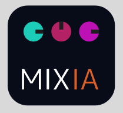

<div align="center">

</div>
<h1 align="center">🚀 MIX AI</h1>

<!-- ## 📝 Cambia esto

- Para evitar errores de conversión entre tipos, usa:
  - `min(static_cast<size_t>(my_uint32_var), my_size_t_var)`
  - `min(my_uint32_var, static_cast<uint32_t>(my_size_t_var))`
- Estos patrones ayudan a mantener la compatibilidad entre tipos `size_t` y `uint32_t` en tu código. -->

## 📄 Descripción

Código del microcontrolador de la primera, Mixer de audio para conciertos y grabaciones, con LLM integrado

🛠️ Requisitos de Hardware
Lista los componentes de hardware necesarios para replicar tu proyecto.

ESP32 M5 Stack V1.11

PCM5102

Cables Jumper

Protoboard (opcional)

Fuente de alimentación de 5V (opcional)

💻 Requisitos de Software
Detalla el entorno de desarrollo y las librerías necesarias.

Arduino IDE (versión 1.8.x o superior) o PlatformIO IDE (recomendado para proyectos más complejos).

Core de ESP32 para Arduino: Asegúrate de tenerlo instalado en tu IDE.

Arduino IDE: Preferencias > URL de Gestores de Tarjetas Adicionales y añade https://raw.githubusercontent.com/espressif/arduino-esp32/gh-pages/package_esp32_index.json

PlatformIO: Se configura automáticamente con platform = espressif32 en platformio.ini.

Librerías de Arduino:

    - m5stack/M5GFX@^0.2.9
    - https://github.com/schreibfaul1/ESP32-audioI2S.git
    - https://github.com/ESP32Async/ESPAsyncWebServer
    - bblanchon/ArduinoJson@^6.21.3
    - https://github.com/nlohmann/json

Puedes instalarlas a través del Gestor de Librerías en Arduino IDE (Herramientas > Gestionar Librerías...) o añadiéndolas a lib_deps en platformio.ini si usas PlatformIO.

⚙️ Configuración del Proyecto (¡Importante para tus Credenciales!)
Este proyecto utiliza información sensible (como credenciales de Wi-Fi o claves de API) que no debe subirse a repositorios públicos como GitHub. Para manejar esto de forma segura, sigue estos pasos:

Crea el archivo Config.h:

En la misma carpeta donde se encuentra tu archivo .ino principal, crea un nuevo archivo llamado Config.h.

No subas este archivo a Git. Ya está incluido en el archivo .gitignore para prevenir su filtración.

Copia el contenido del ejemplo:

Abre el archivo Config.h.example (que sí está en este repositorio).

Copia todo su contenido y pégalo en tu nuevo archivo Config.h.

Rellena tus credenciales:

Modifica el archivo Config.h con tus propias credenciales y configuraciones:

### C++

```
// Config.h (Este archivo NO se sube a GitHub)

#ifndef CONFIG_H
#define CONFIG_H

// Configuración de Wi-Fi
const char* WIFI_SSID = "Tu_Nombre_De_Red_WiFi";
const char* WIFI_PASSWORD = "Tu_Contraseña_De_WiFi";

// Configuración de MQTT / API (Ejemplos)
const char* MQTT_SERVER = "tu.servidor.mqtt";
const int MQTT_PORT = 1883;
const char* MQTT_USER = "tu_usuario_mqtt";
const char* MQTT_PASSWORD = "tu_contraseña_mqtt";

// Otras claves o tokens (Ejemplo)
const char* API_KEY = "tu_clave_api_secreta";

#endif
¡Asegúrate de guardar el archivo Config.h!
```

🚀 Puesta en Marcha

## Clona el proyecto primero

```bash
git clone https://github.com/Joaco2603/MixAi_microcontroler.git

```

## Pasos para compilar y cargar el código en tu ESP32.

Conecta tu ESP32 a tu computadora vía USB.

Abre el proyecto en tu Arduino IDE o PlatformIO.

Selecciona la placa correcta:

En Arduino IDE: Herramientas > Placa > ESP32 Arduino > ESP32 Dev Module (o la que corresponda).

En PlatformIO: Asegúrate de que board = tu_placa_esp32 esté configurado correctamente en platformio.ini.

Selecciona el puerto serial: Herramientas > Puerto > [El puerto de tu ESP32, ej., COMx en Windows, /dev/ttyUSBx en Linux/macOS].

Carga el código: Haz clic en el botón "Subir" (Upload) en tu IDE.

Abre el Monitor Serial: Una vez cargado, abre el Monitor Serial (Herramientas > Monitor Serial) para ver la salida y verificar el funcionamiento. Asegúrate de configurar el baud rate correcto (ej., 115200).

[!WARNING] Verificar la dirección IP

Verificación de la dirección IP: El ESP32 actúa como un servidor al conectarse a internet, y su dirección IP local puede cambiar cada vez que se reinicia. Es crucial que verifiques la dirección IP del dispositivo antes de realizar cualquier llamada a la API. Por ejemplo, en un momento podría ser 192.168.0.3 y, en otro, 192.168.0.4.

## 📜 License

MIX AI is an MIT-licensed open source project.

Mix AI is [MIT licensed](LICENSE).